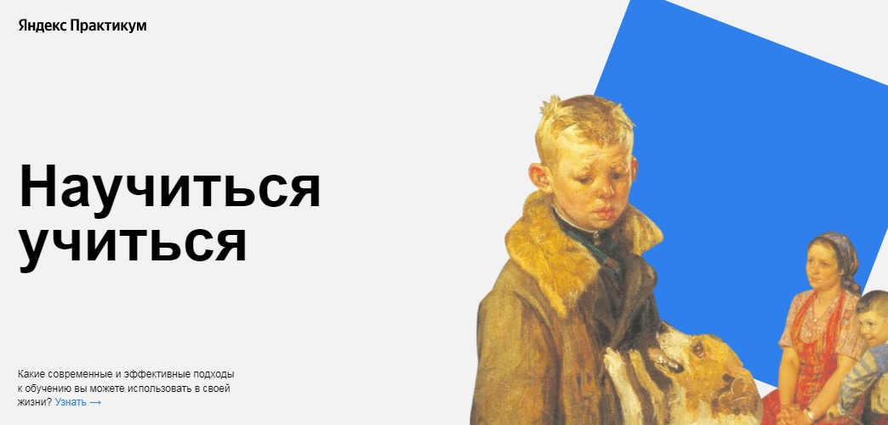

# Проект: Научиться учиться

### О проекте

Это [проект](https://olesia1205.github.io/how-to-learn/index.html) о современных и эффективных подходах к обучению.
В нем раскрываются главные проблемы в обучении, приводятся различные цифры и факты, а так же конкретные техники и
упражнения, способные изменить подход к обучению.

 `Используемые технологии:`

- [x] Верстка сайта с использованием HTML5 и CSS3 по макету из Figma
- [x] Файловая структура проекта БЭМ (Nested)
- [x] Использование Flex для построения сеток и выравнивания
- [x] CSS анимация с использованием @keyframes
- [x] YouTube API
- [x] Обнуление стилей при помощи normalize.css

`План по доработке:`

- [x] Сделать страницу адаптивной для разных устройств

***

 [Ссылка проекта на GitHub](https://olesia1205.github.io/how-to-learn/index.html)
